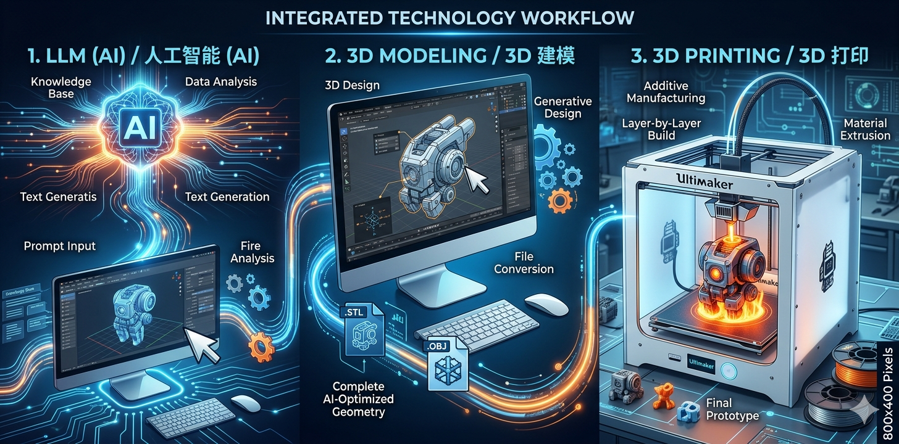

# AI 3D Model Generation Skill

**Turn an idea into a scene-compliant 3D model through natural conversation.**

Conversational requirement gathering → style choices → AI generation → validation & auto-repair → delivery → optional Bambu Lab printing & monitoring

[](LICENSE)
[]()
[]()

---

## What This Skill Does

An AI agent skill that handles the full 3D model lifecycle through chat:

1. **Understand** — chat to figure out what, where, and style
2. **Choose** — offer 2-4 quick options (not 20 parameters)
3. **Generate** — call configured 3D generation API with optimized prompts
4. **Validate** — auto-check against scenario requirements, auto-repair if needed
5. **Deliver** — always deliver a file with a result summary
6. **Print** (optional) — connect Bambu Lab printer, start print, monitor progress

## Three Scenarios

| Scenario | Output | Key Constraints |
|---|---|---|
| **Game Asset** | FBX / GLB | Tri budget by platform, PBR textures, clean UVs |
| **3D Printing** | STL | Manifold, wall thickness ≥1.2mm, correct physical size |
| **PowerPoint** | GLB | ≤40K tris, ≤10MB file, textures embedded |

## Chibi Figurine Workflow

Special interactive workflow for Q版手办 (chibi/blind box style):

1. **text_2_image** — generate 3 candidate images (Pop Mart style)
2. **User selects** — pick favorite from 3 variations
3. **image_2_3d** — convert selected image to 3D model (GLB + STL + preview)
4. **Preview gate** — show thumbnail + 360° GIF, user confirms or regenerates
5. **Validate & deliver** — printability check, auto-repair, print brief

---

## Generation Parameters

| Parameter | Game (Mobile) | Game (PC) | 3D Printing | PowerPoint |
|---|---|---|---|---|
| Tri count | 5K-15K | 15K-50K | 100K+ | 20K-30K |
| Texture | 1024 PBR | 2048 PBR | Optional | 1024 |
| Format | FBX/GLB | FBX/GLB | STL | GLB |
| File size | — | — | — | ≤10MB |

---

## Example: Chibi Figurine Workflow

```
You:   "我想 3D 打印一个 Q版柴犬手办"

Agent: 已知：what=柴犬, where=3D打印, style=Q版
       默认高度 80mm，开始生成 3 张候选效果图...

       text_2_image(chibi_shiba_prompt, count=3)
       📸 3 张 Pop Mart 风格柴犬效果图

You:   "1"

       image_2_3d(candidate_1.png, height=80)
       📦 model.stl + model.glb + model.gif

       3D 预览展示：缩略图 + 360° GIF
       "要继续进入打印检测，还是重新生成？"

You:   "继续"

       analyze.py model.stl --height 80 --repair
       ✅ 水密性通过 | 壁厚 OK | 尺寸 80mm

       ✅ 交付 + Print Brief（层高、填充、支撑建议）
       "是否需要连接 Bambu 打印机开始打印？"

You:   "开始打印"

       bambu.py print model.stl --confirmed
       monitor.py --auto-pause
       🎉 打印完成！
```

---

## Core Scripts

### Model Search

```bash
python3 scripts/search.py "phone stand" --limit 5
```

Searches **MakerWorld, Printables, Thingiverse, and Thangs** simultaneously. Deduped and ranked.

### AI 3D Generation

```bash
python3 scripts/generate.py text "cute cat figurine" --wait --height 60
python3 scripts/generate.py image photo.jpg --wait --height 80
```

- Smart prompt enhancement for print optimization
- Image-to-3D pipeline with auto background removal (`rembg`)
- `--height` auto-scales to exact mm target
- Auto-retry on disconnected meshes
- Format detection + GLB→STL conversion

### Parametric Generation

```bash
python3 scripts/parametric.py bracket --width 30 --height 40 --thickness 3 -o bracket.stl
python3 scripts/parametric.py enclosure --width 60 --depth 40 --height 30 --wall 2 --lid -o case.stl
```

`manifold3d` CSG modeling for functional parts with sub-mm precision.

### Multi-Color AMS Pipeline

```bash
python3 scripts/colorize model.glb --height 80 --max_colors 8 --bambu-map
```

Converts textured GLB → vertex-color OBJ for Bambu AMS filament mapping.

**Pipeline:** Extract texture → HSV classify (shadow-immune) → select N colors → CIELAB assign → quantized PNG → Blender vertex colors → Bambu filament match (43 colors, ΔE distance).

### Printability Analysis & Auto-Repair

```bash
python3 scripts/analyze.py model.stl --height 80 --repair --material PLA
```

11-point check: wall thickness, manifold, overhangs, flat base, floating parts, dimensional tolerance, material compatibility. Tiered repair: trimesh → PyMeshLab → manual guidance.

### Preview Rendering

```bash
python3 scripts/preview.py model.obj --views turntable --height 80 -o preview.gif
```

Blender Cycles rendering. Auto-detects PBR textures, vertex colors, or plain mesh. Turntable 360° GIF.

### Printer Control

```bash
python3 scripts/bambu.py status
python3 scripts/bambu.py print model.3mf
python3 scripts/bambu.py snapshot
python3 scripts/bambu.py ams
```

**LAN mode** (MQTT + FTP) or **Cloud mode**. Supports all 9 Bambu Lab printers.

### AI Print Monitoring

```bash
python3 scripts/monitor.py --interval 300 --auto-pause
```

Camera snapshots → vision AI analysis. Auto-pause on bed detachment or spaghetti.

---

## Quick Start

```bash
git clone https://github.com/heyixuan2/bambu-studio-ai.git
cd bambu-studio-ai
pip3 install -r requirements.txt
python3 scripts/doctor.py    # verify dependencies
```

### API Configuration

This skill uses three API endpoints (user-provided):

| API | Purpose | Used In |
|-----|---------|---------|
| `text_2_image(prompt, count=3)` | Generate candidate images from text | Chibi figurine workflow |
| `image_2_3d(image, height)` | Convert image → 3D model (ZIP: GLB + STL + preview) | After user selects image |
| `generate_3d(prompt, height, format)` | Direct text → 3D model | Game/Print/PPT workflows |

### Configuration Files

**config.json** (shareable):
```json
{
  "model": "A1",
  "mode": "local",
  "printer_ip": "192.168.1.100",
  "serial": "01P00A000000000",
  "3d_provider": "meshy",
  "monitor_level": "standard"
}
```

**.secrets.json** (git-ignored):
```json
{
  "access_code": "printer_lan_access_code",
  "3d_api_key": "your_provider_api_key"
}
```

**Environment variables** (for `tools_api/` examples):
```bash
export GEMINI_API_KEY="your_gemini_api_key"
export IMAGE_2_3D_URL="http://your-server:8000/v3/generation3d"
```

---

## Architecture

```
ai-3d-model/
├── SKILL.md                        Agent skill definition (3 scenarios, 6-step flow)
├── scripts/
│   ├── generate.py                 AI generation (text-to-3D, image-to-3D, auto-scale)
│   ├── analyze.py                  11-point printability analysis, tiered auto-repair
│   ├── colorize/                   Multi-color AMS pipeline (6 modules)
│   │   ├── __init__.py             Pipeline orchestration
│   │   ├── color_science.py        sRGB↔CIELAB, HSV classification
│   │   ├── selection.py            Greedy color selection, mutual exclusion
│   │   ├── texture.py              GLB texture extraction, quantization
│   │   ├── geometry.py             Saliency detection, feature protection
│   │   ├── vertex_colors.py        Blender vertex color application
│   │   └── bambu_map.py            Filament color matching (43 colors)
│   ├── parametric.py               CSG modeling (manifold3d)
│   ├── preview.py                  Blender Cycles rendering
│   ├── bambu.py                    Printer control (LAN + Cloud, 9 printers)
│   ├── monitor.py                  AI print monitoring (vision analysis)
│   ├── search.py                   Model search (4 sources)
│   ├── slice.py                    OrcaSlicer CLI
│   ├── doctor.py                   Dependency verification
│   └── common.py                   Shared config, constants
├── tools_api/                      API usage examples
│   ├── text_2_image.py             Gemini image generation
│   └── image_2_3d.py               Image-to-3D conversion
├── tests/                          57 tests (pytest)
├── references/                     Protocol docs, filament colors, prompt guides
└── config/
    └── config.example.json         Configuration template
```

---

## Supported Printers

All 9 Bambu Lab models: **A1 Mini, A1, P1S, P2S, X1C, X1E, H2C, H2S, H2D**

LAN mode (recommended) or Cloud mode. Camera monitoring, AMS filament control, G-code.

---

## Material Guide

| Material | Nozzle | Bed | Enclosure | Best For |
|----------|--------|-----|-----------|----------|
| **PLA** | 200-210°C | 60°C | Open | General purpose |
| **PETG** | 230-250°C | 80°C | Open | Strength, water resistance |
| **TPU** | 220-240°C | 50°C | Open | Flexible parts, phone cases |
| **ABS/ASA** | 240-260°C | 100°C | Required | Outdoor, heat resistance |
| **Nylon/PA** | 260-280°C | 80°C | Required | Mechanical parts |
| **PEEK/PEI** | 340-350°C | 120°C | H2C/H2D only | Aerospace, medical |

---

## Troubleshooting

Run `python3 scripts/doctor.py` to diagnose dependency issues.

| Problem | Fix |
|---------|-----|
| Can't connect (LAN) | LAN Mode ON? Correct IP? Same network? |
| Model too small/large | Use `--height` to specify exact mm |
| Multi-color shows single color | Import OBJ in new Bambu Studio window (not "import to current") |
| Non-manifold mesh | `analyze.py --repair` auto-fixes most cases |
| Generation failed | Try different provider, more detailed prompt |
| Camera not working | LAN mode only, requires ffmpeg |

---

## Contributing

PRs welcome! Areas that need help:

- Additional 3D generation providers
- Better mesh repair algorithms
- Print failure pattern recognition
- Windows/Linux Bambu Studio integration
- Localization

---

## Version History

| Version | Highlights |
|---------|-----------|
| **1.0.0** | Pipeline sizing fix (`--height` across all tools), smart unit detection in colorize, Printpal format fix, preview dimension verification, parametric modeling (`manifold3d`), 57-test suite, download integrity, MQTT timeout, search dedup |
| **0.23.0** | Colorize → 6-module package, common.py, pyproject.toml, pytest, BYTE_COLOR fix |
| **0.22.0** | Colorize v4: HSV + CIELAB + vertex-color OBJ. Preview renderer (Blender Cycles) |
| **0.20.0** | CLI slicing, auto-orient, Rodin provider, X.509 MQTT |
| **0.18.0** | Model search (4 sources), notifications |

---

## License

MIT — see [LICENSE](LICENSE)
